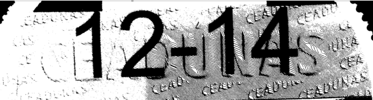

# preprocess-for-ocr

Python script to preprocess an image for OCR so that it looks clear.

Example [Stack overflow answer](https://stackoverflow.com/questions/33881175/remove-background-noise-from-image-to-make-text-more-clear-for-ocr/33961545#33961545):

Before:

After:

